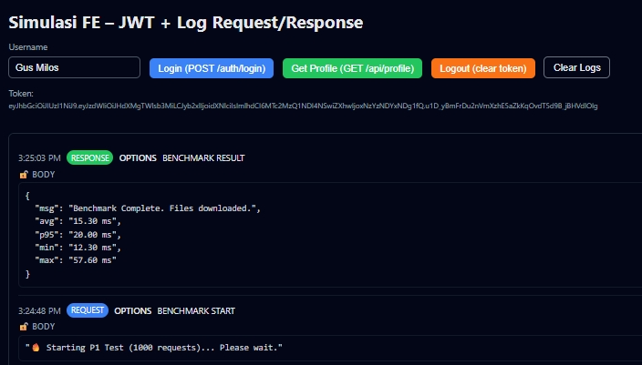

# 🛡️ Custom Encrypted Client–Server Protocol (CECSP)

[](https://opensource.org/licenses/MIT)
[](https://github.com/anggaalfiansah/cecsp-protocol)

## Overview

**CECSP Protocol** adalah prototipe Custom Encrypted Client–Server Protocol yang menyediakan enkripsi penuh pada payload, obfuscation token, dan mekanisme anti-replay. Dirancang untuk menambah lapisan keamanan di atas HTTPS dengan *middleware* server dan klien yang bekerja secara transparan.

## Masalah yang Dipecahkan

Protokol ini dibuat untuk memitigasi risiko *Token Theft* dan *Replay Attack* pada API modern.

| Ancaman | Deskripsi | Mitigasi CECSP |
| :--- | :--- | :--- |
| **Payload Inspection** | Data JSON mudah dibaca, memicu manipulasi parameter dan *logic flaws*. | **Full Payload Encryption** (AES-128-CBC) : Mengunci seluruh data *payload*. |
| **Token Theft** | Token dicuri melalui XSS atau *storage inspection*. | **Token Chunking & Obfuskasi** : Token dipecah, diacak, dan disimpan terenkripsi. |
| **Replay Attack** | Penggunaan ulang *request* yang sah oleh penyerang. | **Timestamp Validation** : Setiap *request* memiliki masa berlaku terbatas. |

## 🚀 Performa

Dalam pengujian, protokol ini menunjukkan efisiensi yang tinggi:

* **Latensi Tambahan Rata-Rata:** **15.3 ms**

## 💻 Instalasi dan Penggunaan

Proyek ini terdiri dari dua komponen utama (`secure-server` dan `secure-client`)  yang berjalan di runtime **Bun**.

### Persiapan (Pre-requisites)

Pastikan **Bun Runtime** sudah terinstal.

### 1. Clone dan Instalasi Dependensi

```bash
git clone [https://github.com/anggaalfiansah/cecsp-protocol.git](https://github.com/anggaalfiansah/cecsp-protocol.git)
cd cecsp-protocol
bun run install
````

*Note: Script* `install` *menggunakan* `concurrently` *untuk menjalankan instalasi di kedua folder proyek (server dan klien) secara bersamaan.*

### 2\. Setup Kunci Rahasia (.env)

Kunci enkripsi (`APP_KEY` dan `APP_IV`) tidak dikomit dan harus dibuat secara lokal:

```bash
bun run secret
```

*Note: Perintah ini menjalankan* `generate-secret.ts` *yang membuat file* `.env` *untuk konfigurasi rahasia.*

### 3\. Menjalankan Mode Development (Dev)

Perintah ini akan menjalankan *server* (`bun --watch server.ts`) dan *klien* (`bun run dev --host`) secara bersamaan menggunakan `concurrently`:

```bash
bun run dev
```

### 4\. Build dan Preview (Mode Produksi Lokal)

Untuk mensimulasikan lingkungan produksi:

```bash
# Lakukan build (termasuk generate kunci rahasia)
bun run build 
# Preview hasil build
bun run preview
```

*Note: Perintah* `preview` *menjalankan server dengan mode* `start` *dan klien dengan mode* `preview --host` *secara bersamaan.* 

## 🛠️ Tech Stack Utama

  * **Runtime:** Bun 
  * **Server:** Express.js 
  * **Client:** React (via Vite)
  * **Library Kriptografi:** `crypto-js` 

## 📜 Lisensi

Proyek ini berada di bawah Lisensi MIT.

## 🧑‍💻 Penulis

**Angga Alfiansah** 

  * Mahasiswa PJJ Sistem Informasi, Universitas Siber Asia
  * [https://www.linkedin.com/in/anggaalfiansah/]

<!-- end list -->

```
```
